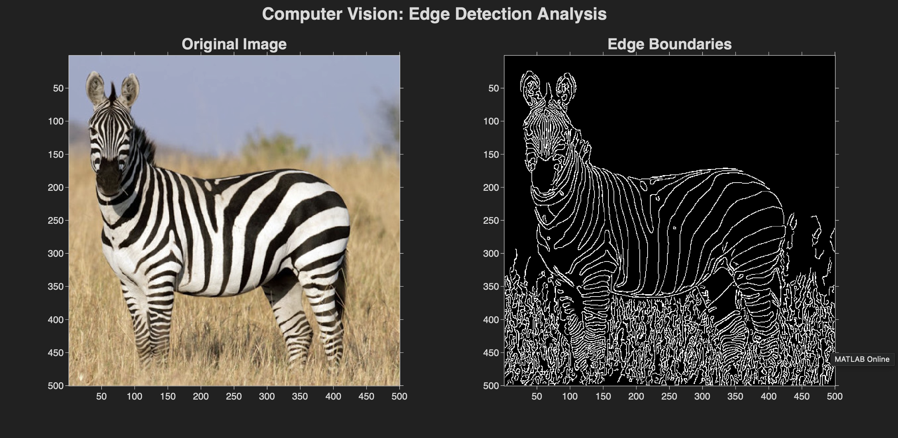
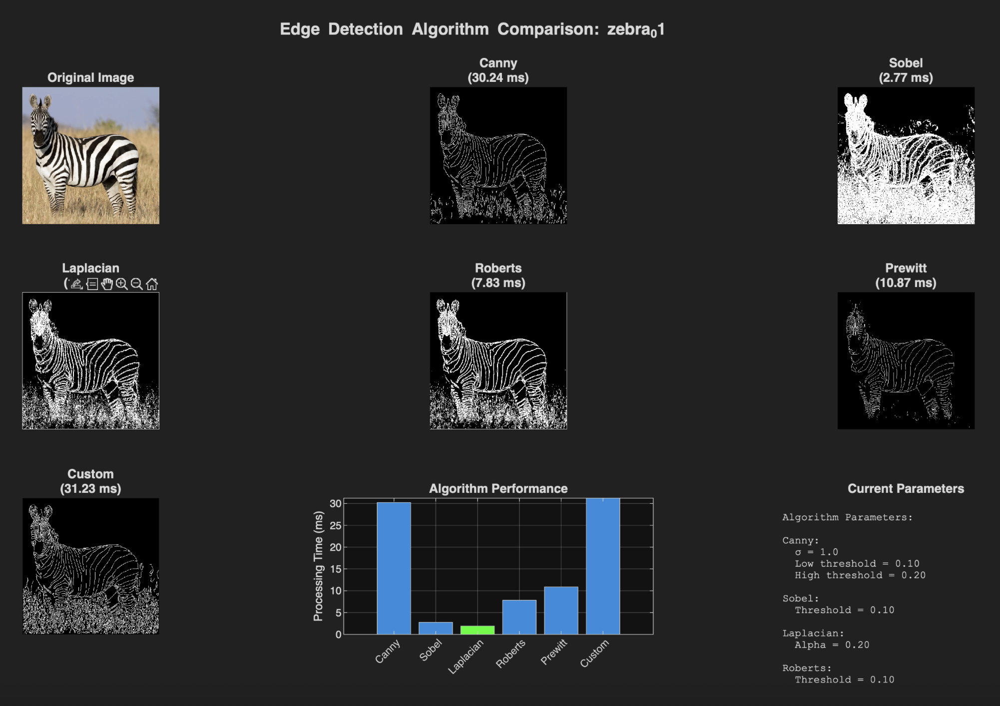

# Advanced Edge Detection Algorithms

A comprehensive MATLAB implementation comparing multiple edge detection algorithms for computer vision applications.

## 🖼️ Results Preview


*Multi-scale edge detection applied to zebra image*


*Performance comparison of 6 different edge detection algorithms*

## 🚀 Features

- **Multiple Algorithms**: Canny, Sobel, Laplacian, Roberts, Prewitt, and custom multi-scale
- **Performance Benchmarking**: Real-time processing speed comparison
- **Visual Analysis**: Side-by-side result visualization
- **Flexible Input**: Supports RGB, grayscale, and RGBA image formats

## 🔧 Quick Start

```matlab
% Run single algorithm demonstration
cd src
edge_detection_demo

% Run algorithm comparison
edge_comparison_demo
